# DevOps CI/CD Pipeline — Task Manager

A Task Manager application built with React and Vite, to demonstrate a complete CI/CD pipeline using GitHub Actions and Vercel with a Blue-Green deployment strategy.

---

## Live Application

**URL:** https://devops-cicd-task-manager.vercel.app

---

## Pipeline Description

The pipeline is defined in `.github/workflows/main.yml` and consists of three jobs that run automatically on every code change.

**Stage 1 — Test (Quality Gate)**

Runs on every push to any branch and on every pull request targeting main. It installs dependencies and executes the full test suite using Vitest. If any test fails, the pipeline stops immediately and no deployment is triggered. This is the core reliability mechanism of the pipeline — broken code cannot reach any environment.

**Stage 2a — Deploy Preview (Green Environment)**

Runs only when a pull request is opened. If the test stage passes, this job deploys the new version to a unique Vercel Preview URL. This preview acts as the Green environment in the Blue-Green strategy — it is fully live and testable but completely isolated from production traffic.

**Stage 2b — Deploy Production (Blue Environment)**

Runs only when a push or merge lands on the main branch. If the test stage passes, this job builds and deploys the application to the production URL. This is the Blue environment — the stable version that all real users access.

---

## Part 1 — Continuous Integration: The Quality Gate

The repository includes a test suite in `src/App.test.jsx` written with Vitest and @testing-library/react. The suite covers three cases: the application renders without crashing, a task can be added to the list, and a task can be deleted from the list.

To verify that the CI gate works correctly, a test was intentionally broken by introducing a failing assertion, then pushed to a feature branch.

**Intentionally broken CI run — pipeline blocked:**

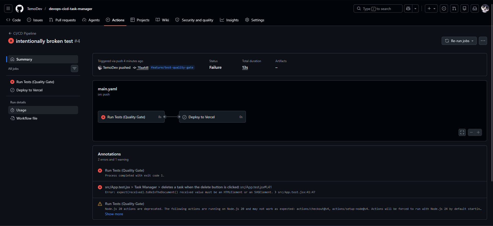

The pipeline failed at the test stage and did not proceed to any deployment. After fixing the test and pushing again, the pipeline passed.

**Fixed CI run — pipeline passes:**

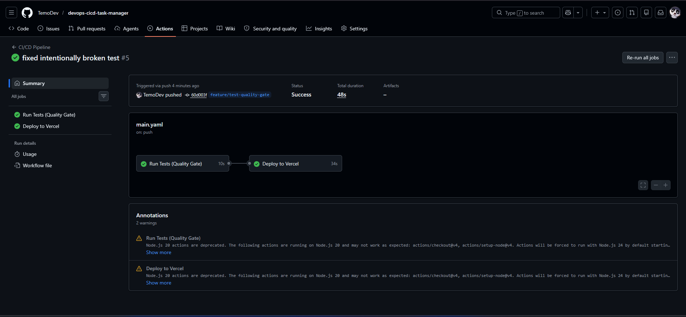

---

## Part 2 — Continuous Deployment: Blue-Green Strategy

### How Blue-Green is implemented in this project

This project maps the Blue-Green pattern directly onto Vercel's deployment model and GitHub Actions conditions.

The production URL (`devops-cicd-task-manager.vercel.app`) represents the Blue environment. It only updates when a pull request is merged into main and all tests pass.

Every pull request triggers a deployment to a unique Vercel Preview URL, which represents the Green environment. This version is fully live and can be inspected and tested before any decision is made to merge. Production is never touched during this phase.

When the pull request is merged, the pipeline promotes Green to Blue by deploying the verified code to production.

### Blue-Green test walkthrough

A feature branch was created with a visible UI change, the application title was updated, to clearly demonstrate the two environments running different versions simultaneously.

**Step 1 — Feature branch pushed, CI runs on the branch:**

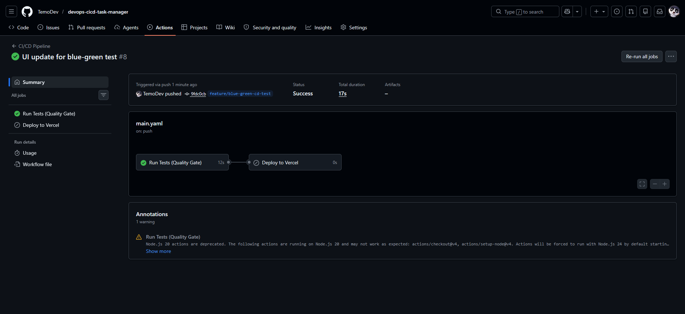

Only the test job runs at this stage. No deployment occurs on a feature branch push.

**Step 2 — Pull request opened, Green environment deployed:**

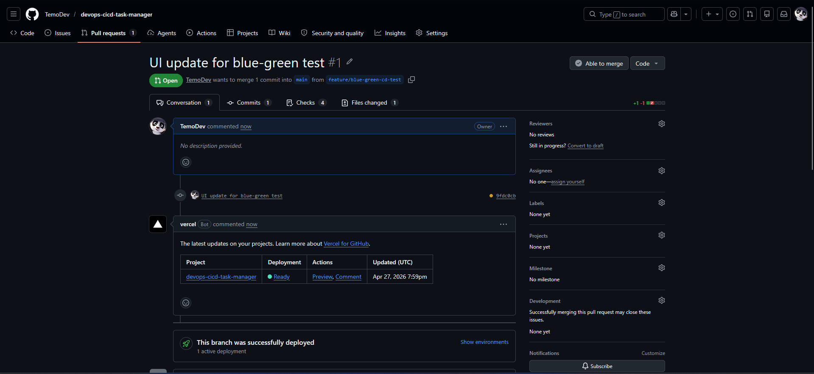

Opening the pull request triggered the `deploy-preview` job. After tests passed, the new version was deployed to a Vercel Preview URL.

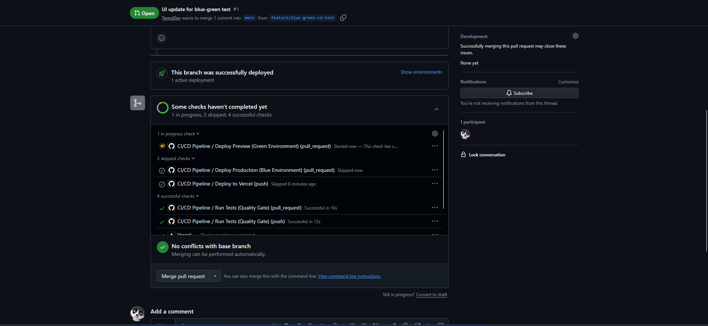

**Step 3 — Two environments running simultaneously:**

The Blue environment (production) still shows the original version:

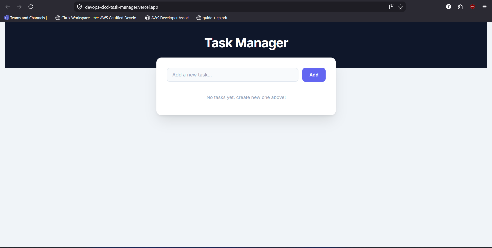

The Green environment (preview) shows the updated version with the new title:

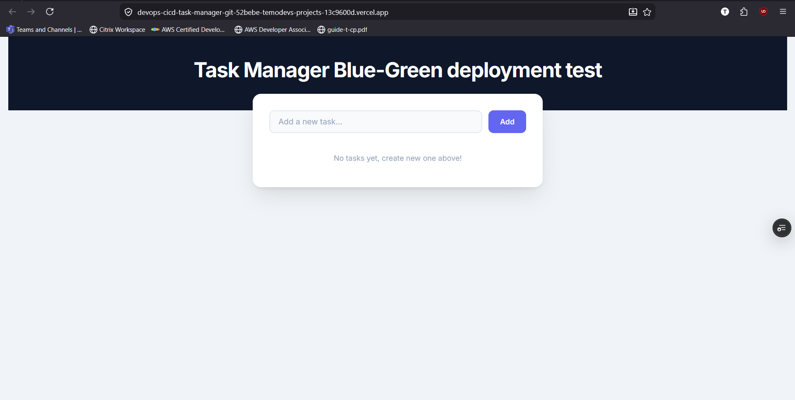

This confirms that the new version is live and testable without affecting production users.

**Step 4 — Pull request merged, Green promoted to Blue:**

After verifying the Green environment, the pull request was merged into main.

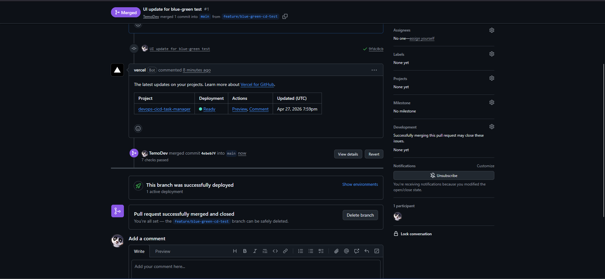

The pipeline ran the full test suite again and then deployed to production.

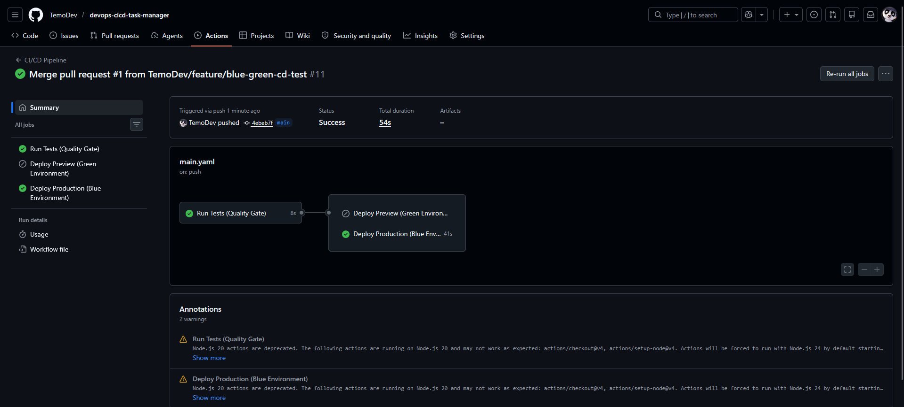

The production URL now reflects the updated version — Green has become the new Blue:

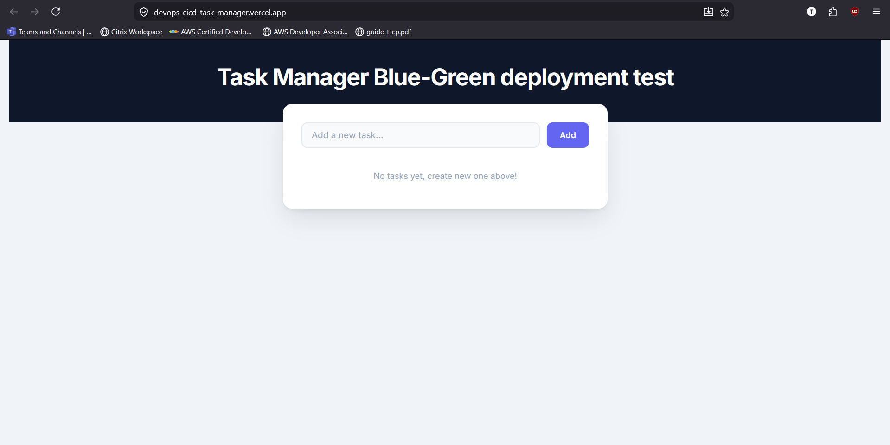

---

## Rollback Guide

If a bug is discovered in production after a deployment, the following steps restore the previous stable version.

### Method 1 — Vercel Dashboard

This is the fastest rollback method. Vercel retains the full deployment history and any previous deployment can be re-promoted to production instantly without a rebuild. The entire process takes under one minute and requires no code changes or redeployment.

**Vercel dashboard — promoting previous deployment:**

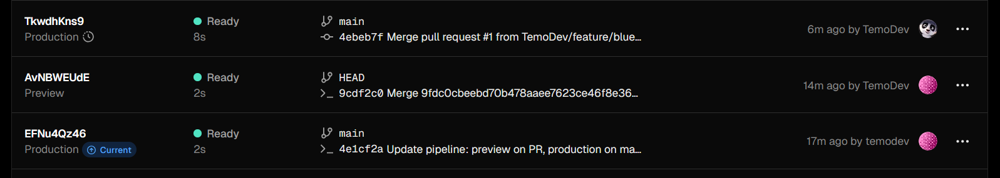

**Production URL after rollback — previous version restored:**

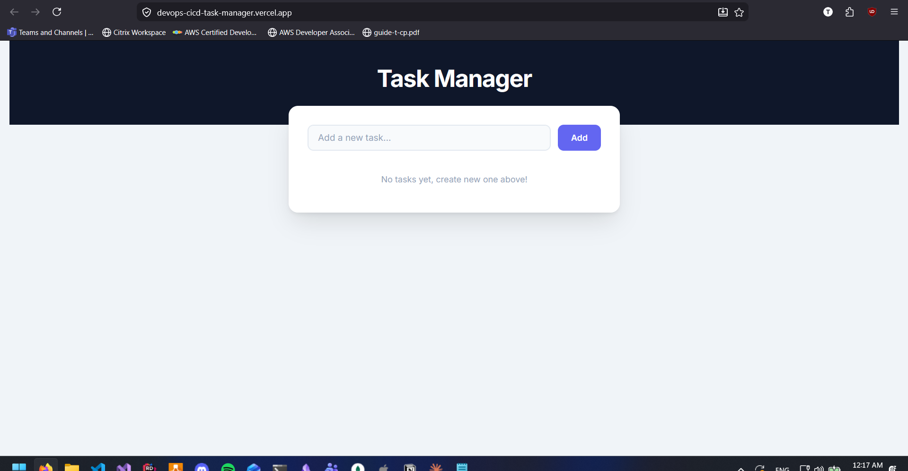

### Method 2 — Git 

We can also get old commit revert to it and push it again to main branch. It will trigger pipeline and new version will be published. 

---

## Repository Structure

```
devops-cicd-task-manager/
├── .github/
│   └── workflows/
│       └── main.yml        # CI/CD pipeline definition
├── screenshots/            # Pipeline and deployment screenshots
├── src/
│   ├── App.jsx             # Main application component
│   ├── App.css             # Application styles
│   ├── App.test.jsx        # Test suite (Vitest)
│   └── main.jsx            # Entry point
├── public/
├── index.html
├── package.json
├── vite.config.js
└── README.md
```

---

## Local Development

```bash
# Clone the repository
git clone https://github.com/TemoDev/devops-cicd-task-manager.git
cd devops-cicd-task-manager

# Install dependencies
npm install

# Start development server
npm run dev

# Run tests
npm test

# Build for production
npm run build
```

---

## GitHub Secrets Required

| Secret | Description |
|---|---|
| `VERCEL_TOKEN` | Vercel account token — Vercel Dashboard → Settings → Tokens |
| `VERCEL_ORG_ID` | Found in `.vercel/project.json` after running `vercel link` |
| `VERCEL_PROJECT_ID` | Found in `.vercel/project.json` after running `vercel link` |

